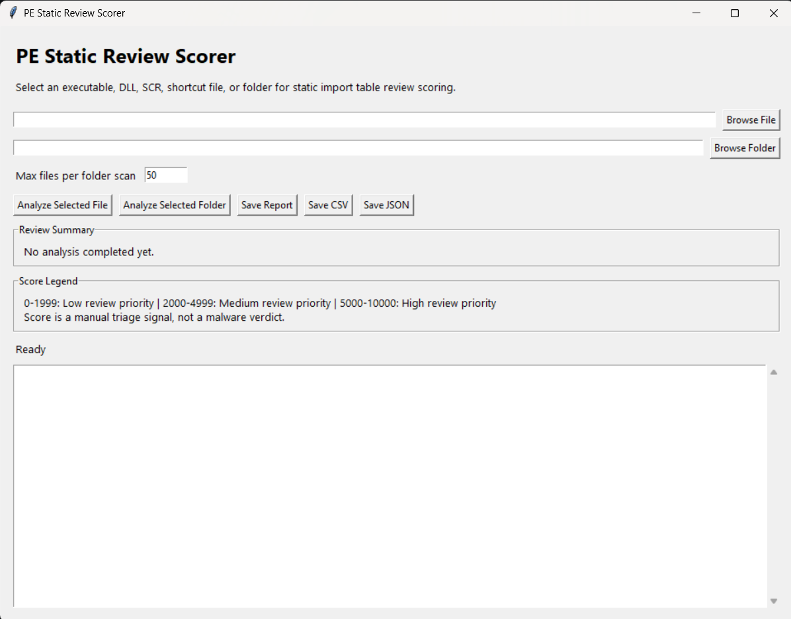
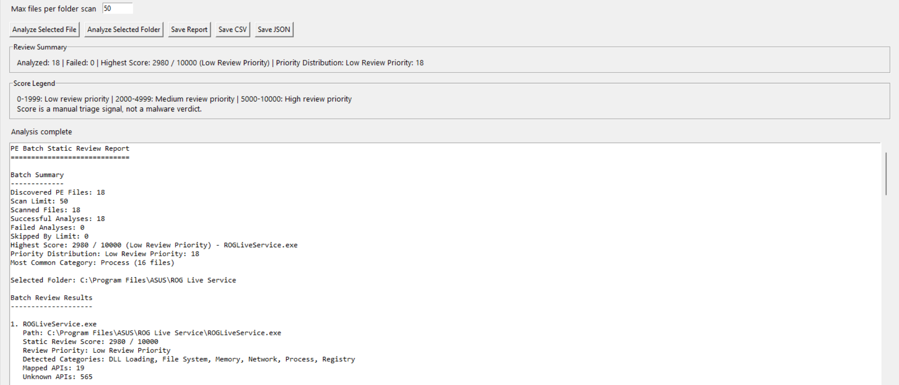
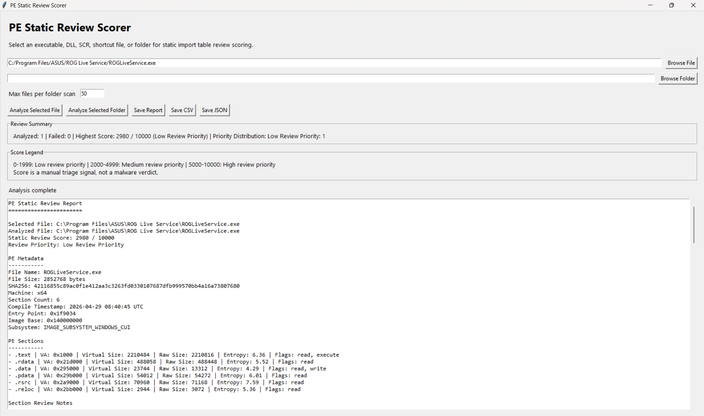
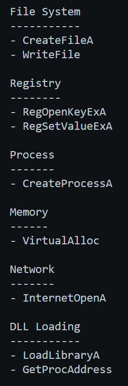

# Windows API Behavior Map

Defensive static PE review tool for mapping imported Windows APIs to behavior categories and producing a manual static review priority score.

The tool does not execute files and does not provide a malware verdict.

## Screenshots

### GUI Overview



### Single File Review



### Batch Review



### API Category Mapping



## Features

- Windows API behavior category mapping
- PE metadata extraction
- PE section summary and review notes
- Imported DLL summary and review notes
- Static string indicator extraction
- Single-file PE review
- Folder-based batch review
- Static review priority score from `0` to `10000`
- GUI review summary panel
- GUI score legend panel
- CSV, JSON, and text report export

## Safety Scope

This is a defensive static analysis project.

It does not:

- execute analyzed files
- classify files as malicious
- include malware samples
- include payloads
- include exploit or bypass instructions

The score is only a manual triage signal.

## Installation

```powershell
pip install -r .\requirements.txt
```

## Run the GUI

```powershell
python .\src\pe_suspicion_scorer_gui.py
```

## Run the CLI Mapper

```powershell
python .\src\api_behavior_mapper.py --imports .\sample-inputs\imports.txt
```

## Review Priority

The score helps decide which files deserve manual review first.

- `0-1999`: Low review priority
- `2000-4999`: Medium review priority
- `5000-10000`: High review priority

A high score does not prove malicious behavior.

## Project Status

Foundation-complete.

Future work can focus on expanding API mappings, improving scoring weights, adding more report templates, and building a broader static triage workflow.